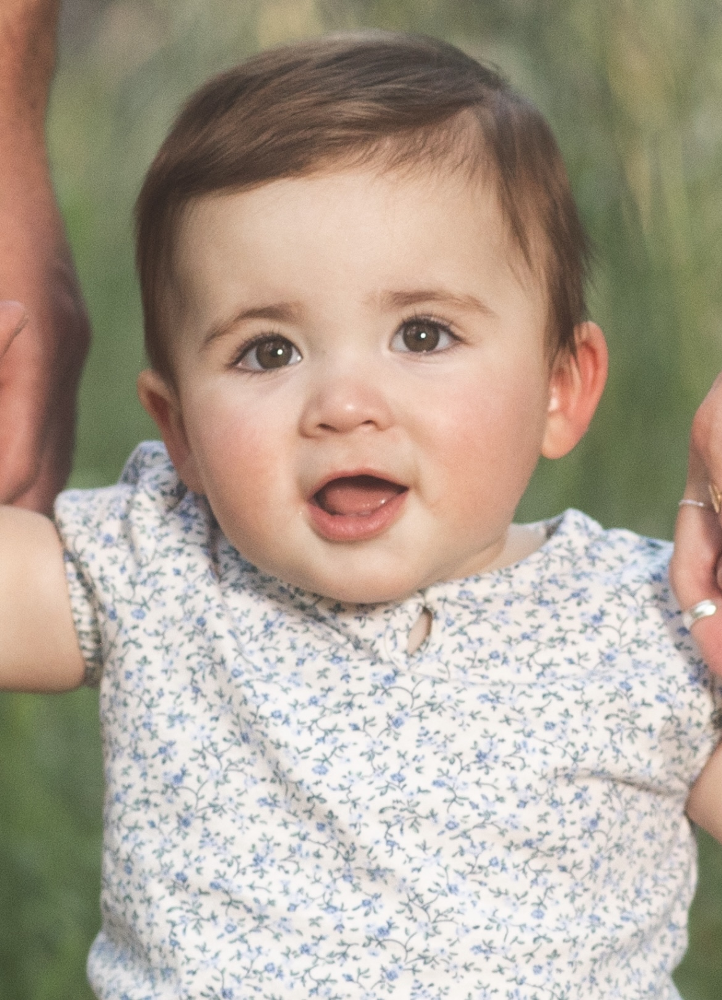
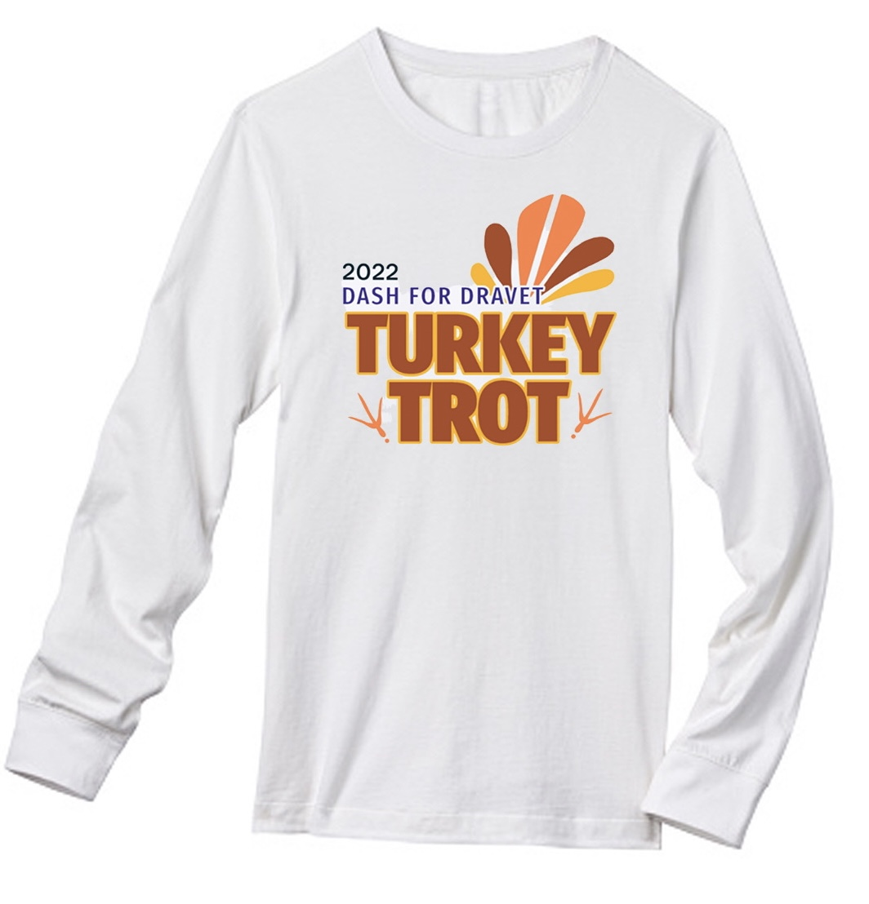
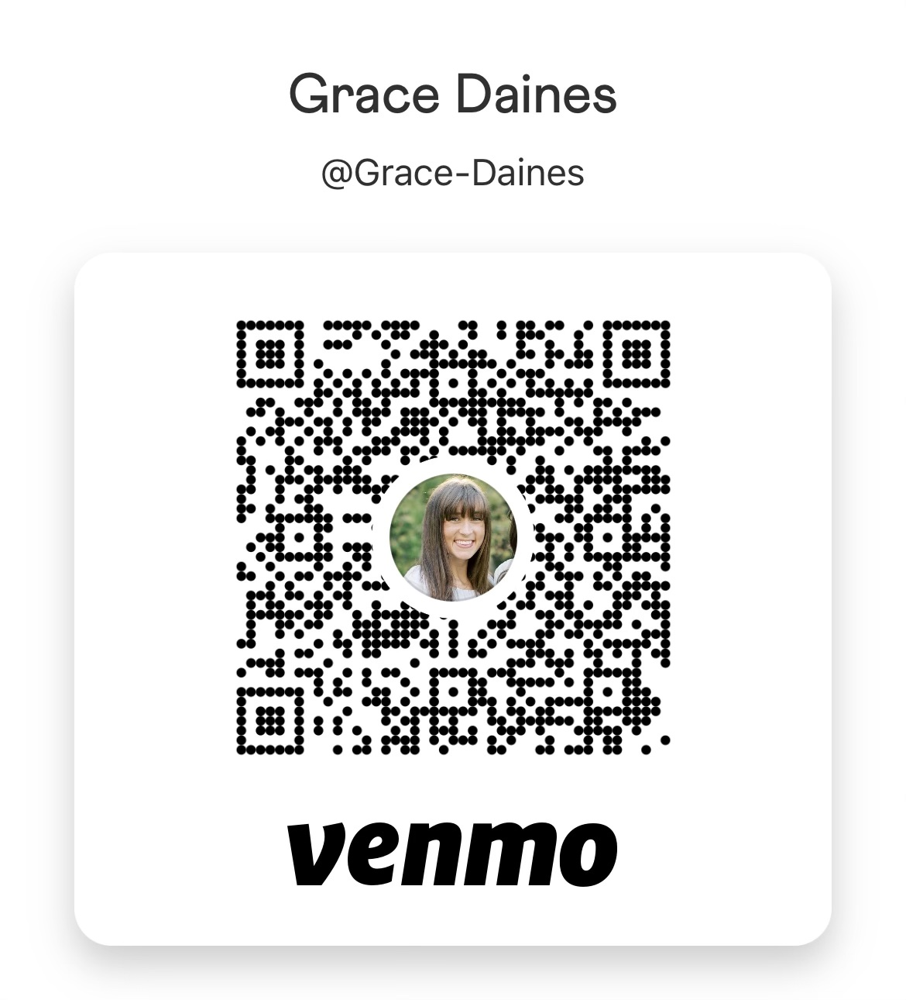

```{r, include=FALSE}
library(emojifont)
```

```{r, include=FALSE}
emoji("smirk")
```

___

# Dash for <span style="color:purple"> Dravet </span> on Turkey Day

<span style="color:black"> Join us for our 1st annual Dash for </span> <span style="color:purple"> Dravet! </span> 

<span style="color:black"> This new family tradition has two parts: the fundraiser and the 5k trot. </span>

<span style="color:black"> The fundraiser is for our girl, Esther, and the <span style="color:purple"> Dravet </span> Syndrome Foundation. </span>

<span style="color:black">The trot is for all you turkeys `r emoji("turkey")` out there wanting to actively support a special cause. This 5k can be accomplished wherever you find yourself on Thanksgiving. You can walk, jog, run, roll or treadmill - it don't matter just have fun! </span>

___

# Esther

:::: {style="display: flex;"}

::: {.column width="40%"}

<center>

{height=75%, width=75%}

</center>

:::

::: {.column width="60%"}

<span style="color:black"> Esther G is our little queen. She's an aspiring competitive eater by day and stuffed animal snuggler by night. She is a pro at making her mom laugh and she already has dad wrapped around her finger. Esther is brave, adventurous, and independent. She started walking this month and there's no stopping her now. She is a cute handful and we love her `r emoji("yellow_heart")` </span>

<span style="color:black"> Esther was diagnosed with <span style="color:purple"> Dravet </span> Syndrome earlier this year. Over the past few months Grace and I have been navigating this scary and unfamiliar territory in hopes of learning as much as we can about this rare syndrome and how it will impact Esther and our family. We pray and hope for the best and thank each of you for your love, prayers, and support of our little family.  </span>


:::
::::

___

## Fundraiser

:::: {style="display: flex;"}

::: {.column width="60%"}

<span style="color:black"> The details are super simple and we want to provide a fun turkey trot t-shirt for those wanting to contribute at these amounts: </span>

* <span style="color:black"> A donation of $50 or more scores an adult t-shirt. </span>

* <span style="color:black"> A donation of $30 or more scores a youth t-shirt. </span>

<span style="color:black"> We are happy to accept donations the entire month of November. If you are interested in a t-shirt please send your donation and t-shirt info by </span>  <span style="color:orange"> **_November 10th_** </span> <span style="color:black"> that way we can get the shirt to you before the Thanksgiving trot. </span>

:::

::: {.column width="40%"}

<center>

{height=85%, width=85%}

</center>

:::
::::

___

## Where to donate

:::: {style="display: flex;"}

::: {.column width="60%"}

<span style="color:black"> Scan this QR code  or search *Grace Daines* on Venmo to donate. </span>

<br>

<span style="color:black"> If you donated and want a t-shirt please click the *T-shirt form* link below to provide your shipping and sizing information. </span>

**[T-shirt form](https://docs.google.com/forms/d/e/1FAIpQLSdb-nLi3hwHwl-4Lu2LMCIgCTSRpqkQGxsNeu31Q4VgtzrFjg/viewform)**

<br>

<span style="color:black"> Thank you so much `r emoji("pray")` </span>


:::

::: {.column width="40%"}

<center>

{height=85%, width=85%}

</center>

:::
::::

___

###### More Info

[Dravet Syndrome Foundation](https://dravetfoundation.org)

___


