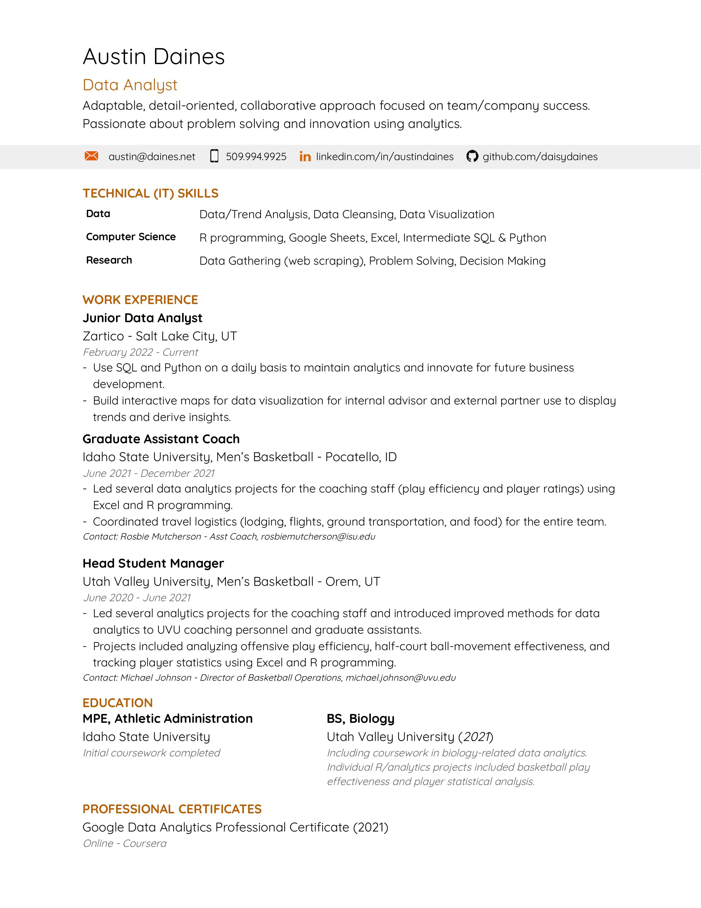

<div style="display: flex;">

<div>

<center>

[{ height=40%, width=40% }](mailto:austin@daines.net)

[{align=center, height=40%, width=40% }](https://www.linkedin.com/in/austin-daines-2766a4217/)

[{ height=40%, width=40% }](https://github.com/daisydaines)

[{ height=40%, width=40% }](https://twitter.com/daisydaines)

</center>

</div>

<div>

<center>

{ height=100%, width=100% }

</center>

</div>

</div>

```{r, message=FALSE, echo=TRUE, warning=FALSE, include=FALSE}
library(knitr)
```


```{r, message=FALSE, echo=TRUE, warning=FALSE, include=FALSE}
resume_v2 <- 
linkedin <- knitr::include_graphics("./Images/linkedin.png")
googlemail <- 
twitter <- knitr::include_graphics("./Images/twitter.png")
github <- knitr::include_graphics("./Images/github.png")
```


```{r, message=FALSE,warning=FALSE,echo=FALSE, dpi = 300, include=FALSE, out.width = "75%", fig.align = "center"}
resume_v2
```

