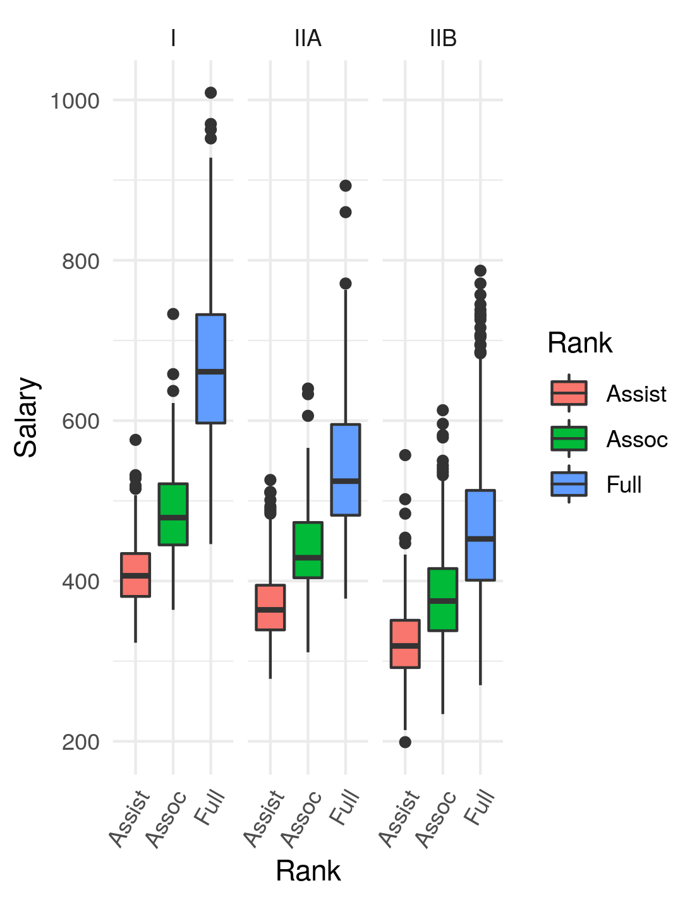

```{r setup, include=FALSE}
knitr::opts_chunk$set(echo = TRUE)
library(tidyverse)
library(janitor)
library(modelr)
library(broom)

```

### I. Load the data FacultySalaries_1995.csv   
College faculty salaries and total compensation from 1995, by Ranks, Tier, and State  College faculty have 3 ranks: Assistant (not tenured), Associate (tenured), and Full (been around forever or something). College "Tier" refers to the amount of funding devoted to research vs the amount of funding for teaching, with Tier I being universities that spend more on research than teaching and award PhD degrees.

```{r, echo=FALSE, warning=FALSE, include=FALSE}
fs <- read_csv("../../Data_Course_DAINES/Exam_4/FacultySalaries_1995.csv")
```

```{r, echo=FALSE, warning=FALSE}
head(fs)
```

Looks a little messy. In order to replicate Figure 1
 we will need to clean the data. 

```{r, echo=FALSE, warning=FALSE, include=FALSE}
names(fs)
fs2 <- select(fs, -c(AvgProfSalaryAll,  AvgFullProfComp,     
                     AvgAssocProfComp,  AvgAssistProfComp, AvgProfCompAll,     
                     NumFullProfs,      NumAssocProfs,       
                     NumAssistProfs,    NumInstructors,     NumFacultyAll))     

fs3 <- fs2 %>% 
  pivot_longer(
    cols = starts_with("Avg"),
    names_to = "Rank",
    names_prefix = "Avg",
    values_to = "Salary")  
fs4 <- fs3 %>% mutate(Rank = as.character(gsub("ProfSalary", "", fs3$Rank)))

fs4 <- fs4[!(fs4$Tier=="VIIB"),]
class(fs4$Tier)
as.factor(fs4$Tier)

# really need to use ggsave rather than jpeg() - Zahn
jpeg("./DAINES_Fig_1.jpg")
ggplot(fs4, aes(y=Salary,x= Rank)) +
  geom_boxplot(aes(fill=Rank)) +
  facet_wrap(~Tier) +
  theme_minimal() +
  theme(axis.text.x = element_text(angle = 55))
dev.off()
```


```{r, echo=FALSE, warning=FALSE}
head(fs4)
```

Oh, much better. 

___ 

Next, we will remake Figure 1

<center>

</center>

***

##### Our remake

```{r, echo=FALSE, warning=FALSE, dpi= 200, fig.height=6, fig.width=4}
ggplot(fs4, aes(y=Salary,x= Rank)) +
  geom_boxplot(aes(fill=Rank)) +
  facet_wrap(~Tier) +
  theme_minimal() +
  theme(axis.text.x = element_text(angle = 55))
```

Not too shabby. 

___

### II. Export an ANOVA table to a file called "Salary_ANOVA_Summary.txt"
The ANOVA model should test the influence of "State", "Tier", and "Rank" on "Salary" but should NOT include any interactions between those predictors.

```{r, echo=FALSE, warning=FALSE}
# factor State before running ANOVA
fs4$State <- as_factor(fs4$State)

# factor State before running ANOVA
fs4$Rank <- as_factor(fs4$Rank)

# create linear model
model <- lm(Salary ~ State + Tier + Rank, data=fs4)

# create sum of squares table using type 3, common in social science
sstable <- aov(model, type = 3)
```

```{r, warning=FALSE}
model <- lm(Salary ~ State + Tier + Rank, data=fs4)
sstable <- aov(model, type = 3)
sstable
```

### III. The rest of the test uses another data set: The "Juniper_Oils.csv" data. Load the data and take a look.
It's not exactly tidy either. Get used to that. It's real data collected as part of a collaboration between Young Living Inc. and UVU Microbiology. A number of dead cedar trees were collected and the chemical composition of their essential oil content was measured. The hypothesis was that certain chemicals would degrade over time since they died in fires. So there are a bunch of columns for chemical compounds, and a column for "YearsSinceBurn." The values under each chemical are Mass-Spec concentrations.

Let's look at the data first 

```{r, warning=FALSE, echo=FALSE, include=FALSE}
jo <- read_csv("../../Data_Course_DAINES/Exam_4/Juniper_Oils.csv")
```


```{r, warning=FALSE, echo=FALSE}
jo
```

Well, it's time to tidy it up so we can reproduce Figure 2. 

<center>

</center>

```{r, warning=FALSE, echo=FALSE, include=FALSE}
jo1 <- jo %>% 
  select(c("alpha-pinene","para-cymene","alpha-terpineol","cedr-9-ene","alpha-cedrene",
           "beta-cedrene","cis-thujopsene","alpha-himachalene","beta-chamigrene","cuparene",
           "compound 1","alpha-chamigrene","widdrol","cedrol","beta-acorenol","alpha-acorenol",
           "gamma-eudesmol","beta-eudesmol","alpha-eudesmol","cedr-8-en-13-ol","cedr-8-en-15-ol",
           "compound 2","thujopsenal","YearsSinceBurn"))

jo2 <- jo1 %>% 
  pivot_longer(cols= "alpha-pinene":"thujopsenal",  
    names_to = "ChemicalID",
    values_to = "Concentration") 
```

___

Here is our tidy data:

```{r, warning=FALSE, echo=FALSE}
glimpse(jo2)
```

That looks much better. 

___

### IV. Make a graph of the following:
        x = YearsSinceBurn
        y = Concentration
        facet = ChemicalID (use free y-axis scales)
```{r,  warning=FALSE, echo=FALSE, message= FALSE, dpi=200, fig.width=8}
ggplot(jo2, aes(x = YearsSinceBurn, y = Concentration)) + 
  facet_wrap(~ChemicalID, scales = "free") +
  geom_smooth(size=1.1) +
  theme_minimal()
```

### V. Finally, we will use a generalized linear model to find which chemicals show concentrations that are significantly (significant, as in P < 0.05) affected by "Years Since Burn". 

##### I'll show you what I mean. Here is the data frame I need you to produce from your glm model:
          A tibble: 6 x 5
          term                          estimate std.error statistic  p.value
          <chr>                            <dbl>     <dbl>     <dbl>    <dbl>
          1 alpha-cedrene                    7.88      1.93       4.08 4.97e- 5
          2 cedr-8-en-13-ol                  7.62      1.93       3.95 8.72e- 5
          3 cedrol                          22.5       1.93      11.7  5.12e-29
          4 cis-thujopsene                  17.3       1.93       8.95 2.93e-18
          5 widdrol                          5.82      1.93       3.01 2.69e- 3
          6 cis-thujopsene:YearsSinceBurn    0.332     0.141      2.35 1.90e- 2
          
Let's see how we did

```{r, warning=FALSE, echo=FALSE}
modJO <- glm(data = jo2, Concentration ~ ChemicalID * YearsSinceBurn)

tidy(modJO) %>%
filter(p.value <= 0.05) %>%
mutate(term = term %>% str_remove_all("ChemicalID"))
```

___

<style>
div.blue { background-color:#e6f0ff; border-radius: 5px; padding: 20px;}
</style>
<div class = "blue">

## Success!

</div>